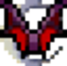
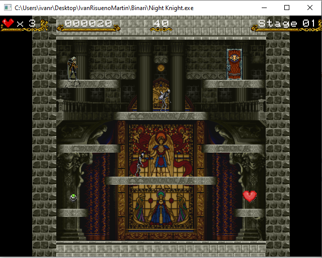
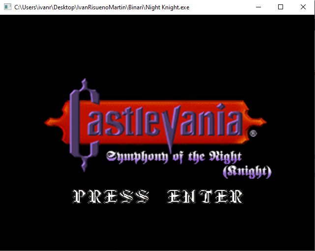

<br/>
<p align="center">
  <a href="https://github.com/ivan-risueno/FIB-VJ-2DGame">
    
  </a>

  <h3 align="center">Night Knight</h3>

  <p align="center">
    An alternative version of the MSX videogame!
    <br/>
    <br/>
  </p>
</p>

 

## Table Of Contents

* [About the Project](#about-the-project)
* [Built With](#built-with)
* [Getting Started](#getting-started)
  * [Installation](#installation)
* [Usage](#usage)
* [Authors](#authors)
* [Acknowledgements](#acknowledgements)

## About The Project



Mark: 10

This is a videogame made for the Videogames course at the FIB(UPC, 2022Q2). Professors asked us to copy the mechanics of the popular game [Night Knight](https://www.usebox.net/jjm/night-knight/) for the MSX, making three levels with different enemies, a main menu and a scoreboard. We chose to add textures and sounds from one of my ever favourite games, Castlevania Symphony of the Night.

The game:
In order to win, you will have to clear all three stages. To clear one stage, just open the door. But how? You will need the key! You can obtain the key by stepping on all the tiles of the level. Beware of the enemies and the time left.

Controls:
- Main Menu: Use the UP and DOWN arrow keys to navigate between options, and press ENTER to select.
- In-game: Use the LEFT and RIGHT arrow keys to move, and UP to jump. At any time, you can jump to level 1 with the '1' key, level 2 with the '2' key, and level 3 with the '3' key.

Descriptions of game entities:
- Player: Controls the player and moves as described in the controls.
- Door: Necessary to move from one level to the next. The door opens only when the key is collected.
- Key: Appears when all map tiles are stepped on (accompanied by a visual effect when stepped on), or when the 'K' key is pressed.
- Gem: Appears once per level after a certain time and awards the player 100 points.
- Stopwatch: Appears once per level after a certain time, and pauses enemies for 3 seconds. However, enemies can still harm the player upon collision.
- Heart: Appears once per level after a certain time (or when the 'H' key is pressed) and grants the player an extra life.
- Skeleton: Appears at the beginning of the level and walks from left to right. It's the most basic enemy.
- Ball: Appears at the beginning of the level and rolls from left to right, falling on platforms below. When it reaches the bottom of the level, it reappears at its initial position. The ball reverts the state of tiles (from stepped on to NOT stepped on) when passing over them.
- Vampire: Appears at the beginning of the level. When in its normal state, it acts like the skeleton. Suddenly, it transforms and starts flying diagonally until it transforms back.

## Built With

This videogame is built from scratch using OpenGL libraries made in C, and coded in Visual Sudio. You are free to modify the source code as you want, but you will need the Visual Studio Build Tools from 2015.

## Getting Started


### Installation

1. Clone the repo

```sh
git clone https://github.com/your_username_/Project-Name.git
```
That's it! This repo contains an already compiled-portable version of the game along with the source code, so you won't need to install nothing.

## Usage

To run the game, just open the executable file [Night Knight.exe](https://github.com/ivan-risueno/FIB-VJ-2DGame/blob/main/Binari/Night%20Knight.exe) located in the _Binari_ directory.



### Creating A Pull Request


## Authors

* **Iván Risueño** - *Author* - [Iván Risueño](https://github.com/ivan-risueno/) - *Major features of the game*
* **Xavier Leonardo** - *Author* - [Xavier Leonardo](https://github.com/Xasyo) - *Major features of the game*

## Acknowledgements

* [Juan J. Martínez](https://www.usebox.net/jjm/about/me/)
